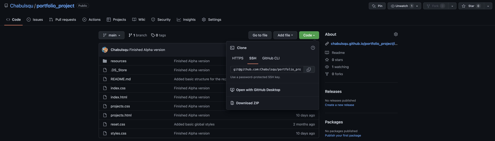

# Portfolio Project
### Front-end Portfolio Website made up of two pages featuring my past experience, projects and interactivity with Javascript

The project was made out of accessible HTML 5 (with use of ARIA attributes), pure CSS 3 (no frameworks or libraries) and vanilla Javascript with DOM access. The website is responsive for mobile phones (320px, 375px and 480px), tablets (768px), Laptops (1024px) and computers (1440px). If you want to help with the project, feel free to directly make a pull request or post an issue. You can contact me on [Twitter](https://twitter.com/mateo_fain) or [dev.to](https://dev.to/chabulsqu).

## How to try it

To run the project you can simply type https://chabulsqu.github.io/portfolio_project/index.html on your browser or click [this link](https://chabulsqu.github.io/portfolio_project/index.html). You can also run the project on your own computer, to do this go to the main folder of the project and select Code > "download as a ZIP" to download the whole repository folder and then execute the file on your favourite browser.

## Donations

If you like my work and would like to support me you can [buy me a coffee](https://www.buymeacoffee.com/mateof).